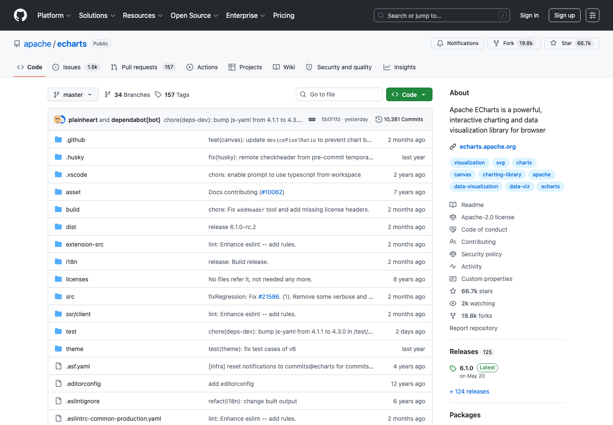

# 数据分析与可视化工具

> 整理 Python 数据分析、数据库、本地 dashboard、交互图表和 BI 工具。

  
  
  

图片来源：公开入口预览图，[https://github.com/apache/echarts](https://github.com/apache/echarts)，截取/整理日期：2026-07-02。

## 定位

本仓库是一份面向中文用户的主题索引，重点整理常用、稳定、值得优先了解的工具入口，并补充适用场景、选型建议和风险边界。目标不是追求数量，而是降低第一次检索和筛选的成本。

- **主题**：数据 / 可视化
- **适合人群**：科研、运营、产品、数据分析和 dashboard 用户
- **首批重点**：Jupyter / Pandas / Polars / DuckDB / Plotly
- **为什么值得整理**：数据可视化是跨行业刚需，开源工具成熟，适合做长期维护总表。

## 使用方式

1. 先看 [精选资源](#精选资源)，按自己的场景挑 2-3 个入口试用。
2. 再看 [选型建议](#选型建议)，避免一上来把同类工具全装一遍。
3. 如果用于课程、论文、开源项目或生产环境，务必看 [风险提醒](#风险提醒)。

## 收录口径

同时覆盖科研图、交互图、dashboard 和 BI，强调可复现和数据权限。

优先收录：

- 官方文档、官网、活跃 GitHub 仓库；
- 免费可试用或开源项目；
- 中文用户高频搜索、收藏、复用的工具；
- 入口稳定、说明清楚、维护状态可判断的资源。

暂不收录：

- 破解软件、灰色下载、账号代认证、返利推广；
- 长期不可访问或入口频繁变化的镜像；
- 只有营销话术、没有清晰文档的产品；
- 与本主题关系很弱的泛泛工具。

## 精选资源

| 名称 | 适合场景 | 入口 |
| --- | --- | --- |
| Jupyter | Notebook 数据分析环境。 | [访问](https://jupyter.org/) |
| Pandas | Python 数据分析基础库。 | [访问](https://pandas.pydata.org/) |
| Polars | 高性能 DataFrame。 | [访问](https://pola.rs/) |
| DuckDB | 嵌入式分析数据库。 | [访问](https://duckdb.org/) |
| Plotly | 交互式图表。 | [访问](https://plotly.com/python/) |
| Apache ECharts | 强大的开源可视化图表库。 | [访问](https://echarts.apache.org/) |
| Streamlit | 快速构建数据 App。 | [访问](https://streamlit.io/) |
| Apache Superset | 开源 BI 平台。 | [访问](https://superset.apache.org/) |
| Matplotlib | Python 科研绘图基础库。 | [访问](https://matplotlib.org/) |
| Seaborn | 统计图表和论文草图常用库。 | [访问](https://seaborn.pydata.org/) |
| Observable | 交互式数据 notebook 和可视化社区。 | [访问](https://observablehq.com/) |
| Metabase | 开源 BI 和内部数据看板。 | [访问](https://www.metabase.com/) |

## 选型建议

- 小数据先用 Pandas，大数据或本地分析优先试 DuckDB/Polars。
- 对外交付可使用 Streamlit 或 Superset。
- 论文图表优先保证可复现。

## 风险提醒

- 图表复杂度不应超过数据表达需求。
- dashboard 上线前需处理权限控制和数据脱敏。

## 维护说明

- 本仓库会优先更新失效链接、官方入口变更和明显过时的描述。
- 新增资源请尽量给出官网、GitHub 仓库、文档页或可验证的公开说明。
- 推荐新资源时，请说明具体场景和选择理由，避免只写泛泛评价。

## 数据文件

结构化数据见 [`data/links.json`](data/links.json)，可用于脚本生成网页、表格或个人导航页。

## Contributing

欢迎提交 PR 修正链接、补充官方文档、更新截图或改进中文说明。请保持描述短、准、可验证。

## License

MIT。第三方商标、截图、网页内容和产品名称归各自权利方所有，本仓库只做索引和学习整理。
